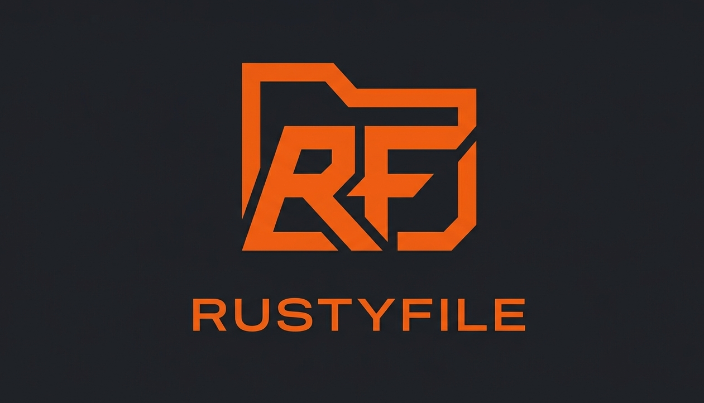

<p align="center">
  
</p>

<p align="center">A fast, lightweight, self-hosted file browser built in Rust.</p>

<p align="center">
  <a href="https://github.com/zaakirio/RustyFile/actions/workflows/ci.yml"></a>
  <a href="LICENSE"></a>
</p>

## Why RustyFile?

Most self-hosted file browsers are written in Go or PHP. RustyFile takes a different approach -- Rust's zero-cost abstractions, no garbage collector, and a single static binary that starts in milliseconds and idles at ~15 MB.

### How It Compares

| | RustyFile | [FileBrowser](https://github.com/filebrowser/filebrowser) | [Filestash](https://github.com/mickael-kerjean/filestash) | [Nextcloud](https://nextcloud.com) |
|---|---|---|---|---|
| **Language** | Rust | Go | Go | PHP |
| **Memory baseline** | ~15 MB | Not documented | 128-512 MB | 512 MB+ |
| **Startup** | Sub-50 ms | Seconds | Seconds | Seconds (PHP init) |
| **Single binary** | Yes | Yes | Yes | No (requires LAMP stack) |
| **License** | MIT | Apache 2.0 | AGPL-3.0 | AGPL-3.0 |
| **Storage backends** | Local filesystem | Local filesystem | 20+ (S3, FTP, WebDAV...) | Local + integrations |
| **Project status** | Active | Maintenance-only | Active | Active |

**Where RustyFile wins:** startup speed, memory footprint, and deployment simplicity. Drop a single binary on a Raspberry Pi or NAS and go.

**Where others win:** Filestash supports 20+ remote storage backends. Nextcloud is a full collaboration suite (calendar, contacts, document editing). If you need those, RustyFile isn't the right tool.

## Features

- **File browsing** -- navigate directories, view metadata, sort by name/size/date/type
- **Resumable uploads** -- TUS 1.0.0 protocol with drag-and-drop, progress tracking, and automatic cleanup of expired uploads
- **Full-text search** -- SQLite FTS5-powered filename search with filters (type, size, date range, path scope)
- **Video streaming** -- HLS adaptive streaming with on-the-fly transcoding, plus direct MP4/WebM via HTTP Range requests
- **Thumbnail generation** -- on-demand JPEG thumbnails for images (PNG, JPEG, WebP) with disk caching
- **In-browser text editing** -- edit code and config files, saved atomically
- **Authentication** -- JWT (HS256) + Argon2id password hashing, HttpOnly cookie and Bearer token support
- **File watching** -- filesystem changes automatically update the search index and invalidate directory caches
- **Rate limiting** -- per-IP login throttling (10 attempts / 15 minutes) via token bucket
- **Caching** -- ETag conditional requests (304 Not Modified), LRU directory listing cache with TTL, immutable thumbnail cache
- **Security headers** -- CSP, X-Content-Type-Options, X-Frame-Options, restrictive CORS
- **Zero-config onboarding** -- first visit creates the admin account, no config files needed

## Quick Start

### Binary

```bash
curl -fsSL https://github.com/zaakirio/RustyFile/releases/latest/download/rustyfile-linux-amd64.tar.gz | tar xz
./rustyfile --root ./my-files --port 8080
# Visit http://localhost:8080 to create your admin account
```

### Docker

```bash
docker run -d \
  -p 8080:80 \
  -v /path/to/your/files:/data \
  -v rustyfile_data:/config \
  rustyfile:latest
```

### Docker Compose

```yaml
services:
  rustyfile:
    image: rustyfile:latest
    ports:
      - "8080:80"
    volumes:
      - ./files:/data
      - rustyfile_data:/config
    restart: unless-stopped

volumes:
  rustyfile_data:
```

### From Source

```bash
git clone https://github.com/zaakirio/RustyFile.git
cd RustyFile
make build
./target/release/rustyfile --root ./test-data --port 8080
```

## Configuration

RustyFile uses layered configuration (highest priority wins):

```
CLI flags  >  Environment variables (RUSTYFILE_*)  >  config.toml  >  Defaults
```

### Options

| Option | Env Var | Default | Description |
|--------|---------|---------|-------------|
| `--host` | `RUSTYFILE_HOST` | `0.0.0.0` | Listen address |
| `--port` | `RUSTYFILE_PORT` | `8080` | Listen port |
| `--root` | `RUSTYFILE_ROOT` | `./data` | Directory to serve |
| `--data-dir` | `RUSTYFILE_DATA_DIR` | `./rustyfile-data` | Database & state directory |
| `--cache-dir` | `RUSTYFILE_CACHE_DIR` | `./rustyfile-data/cache` | Cache directory (thumbnails, TUS temp files, HLS segments) |
| `--log-level` | `RUSTYFILE_LOG_LEVEL` | `info` | Log level (trace/debug/info/warn/error) |
| `--log-format` | `RUSTYFILE_LOG_FORMAT` | `pretty` | Log format (`json` or `pretty`) |
| `--jwt-expiry-hours` | `RUSTYFILE_JWT_EXPIRY_HOURS` | `2` | JWT token lifetime |
| `--min-password-length` | `RUSTYFILE_MIN_PASSWORD_LENGTH` | `10` | Minimum password length |
| `--max-password-length` | `RUSTYFILE_MAX_PASSWORD_LENGTH` | `128` | Maximum password length (Argon2 DoS protection) |
| `--max-upload-bytes` | `RUSTYFILE_MAX_UPLOAD_BYTES` | `52428800` | Max request body size (50 MB) |
| `--max-listing-items` | `RUSTYFILE_MAX_LISTING_ITEMS` | `10000` | Max items in directory listing |
| `--setup-timeout-minutes` | `RUSTYFILE_SETUP_TIMEOUT_MINUTES` | `5` | Setup wizard timeout |
| `--tus-expiry-hours` | `RUSTYFILE_TUS_EXPIRY_HOURS` | `24` | Hours before incomplete uploads expire |
| `--cors-origins` | `RUSTYFILE_CORS_ORIGINS` | `*` | Allowed CORS origins (comma-separated) |
| `--trusted-proxies` | `RUSTYFILE_TRUSTED_PROXIES` | _(empty)_ | Trusted proxy IPs for X-Forwarded-For (comma-separated) |
| `--secure-cookie` | `RUSTYFILE_SECURE_COOKIE` | `true` | Set Secure flag on auth cookies (disable for HTTP dev) |
| `--config` | -- | `config.toml` | Config file path |

See [`config.toml.example`](config.toml.example) for a full example.

## API Reference

### Public Endpoints

| Method | Path | Description |
|--------|------|-------------|
| `GET` | `/api/health` | Health check |
| `GET` | `/api/setup/status` | Setup required? `{ setup_required: bool }` |
| `POST` | `/api/setup/admin` | Create initial admin (first run only) |
| `POST` | `/api/auth/login` | Login with username/password |
| `POST` | `/api/auth/logout` | Logout (clears HttpOnly cookie) |
| `POST` | `/api/auth/refresh` | Refresh JWT token |

### Protected Endpoints (require `Authorization: Bearer <token>`)

#### File Operations

| Method | Path | Description |
|--------|------|-------------|
| `GET` | `/api/fs` | List root directory |
| `GET` | `/api/fs/{path}` | List directory or get file info |
| `GET` | `/api/fs/{path}?content=true` | Get file info with text content |
| `PUT` | `/api/fs/{path}` | Save file content |
| `POST` | `/api/fs/{path}` | Create directory (`{"type":"directory"}`) |
| `DELETE` | `/api/fs/{path}` | Delete file or directory |
| `PATCH` | `/api/fs/{path}` | Rename/move (`{"destination":"new/path"}`) |
| `GET` | `/api/fs/download/{path}` | Download file (supports Range requests) |
| `GET` | `/api/fs/download/{path}?inline=true` | View file inline in browser |

#### Search

| Method | Path | Description |
|--------|------|-------------|
| `GET` | `/api/fs/search?q=...` | Full-text filename search |

Search supports these query parameters: `q` (query), `type` (file/dir/image/video/audio/document), `min_size`, `max_size`, `after`, `before`, `path` (scope to directory), `limit` (default 50), `offset`.

#### TUS Resumable Uploads

| Method | Path | Description |
|--------|------|-------------|
| `OPTIONS` | `/api/tus/` | TUS capability discovery |
| `POST` | `/api/tus/` | Create upload (`Upload-Length` + `Upload-Metadata` headers) |
| `HEAD` | `/api/tus/{id}` | Query upload offset |
| `PATCH` | `/api/tus/{id}` | Append chunk (`Content-Type: application/offset+octet-stream`) |
| `DELETE` | `/api/tus/{id}` | Cancel and delete upload |

Upload metadata is base64-encoded in the `Upload-Metadata` header with `filename` and `destination` keys.

#### Thumbnails

| Method | Path | Description |
|--------|------|-------------|
| `GET` | `/api/thumbs/{path}` | Get image thumbnail (JPEG, max 300px, cached) |

#### HLS Video Streaming

| Method | Path | Description |
|--------|------|-------------|
| `GET` | `/api/hls/playlist/{path}` | Get M3U8 playlist for video |
| `GET` | `/api/hls/segment/{key}/{index}` | Get individual `.ts` segment |

### Video Streaming

The download endpoint supports HTTP Range requests for seeking:

```bash
# Seek to byte offset
curl -H "Authorization: Bearer $TOKEN" -H "Range: bytes=1000000-" \
  http://localhost:8080/api/fs/download/video.mp4
```

For adaptive streaming, the HLS endpoints transcode video into segments on demand (requires `ffmpeg` on the host).

### Authentication Flow

```
1. POST /api/setup/admin   -- First run: create admin, get JWT
2. POST /api/auth/login    -- Subsequent: login, get JWT
3. Authorization: Bearer <token>   (or HttpOnly cookie)
4. POST /api/auth/refresh  -- Renew before expiry
```

### Error Format

All errors return `{ "error": "message", "code": "ERROR_CODE" }`.

| Status | Code | When |
|--------|------|------|
| 400 | `VALIDATION_ERROR` | Invalid input |
| 401 | `UNAUTHORIZED` | Missing or invalid token |
| 403 | `FORBIDDEN` | Insufficient permissions |
| 404 | `NOT_FOUND` | Resource doesn't exist |
| 409 | `CONFLICT` | Resource already exists |
| 410 | `SETUP_EXPIRED` | Setup timeout elapsed |
| 500 | `INTERNAL_ERROR` | Server error |

## Architecture

```
src/
  main.rs                  -- config, logging, DB, filesystem watcher, server startup
  lib.rs                   -- library root
  config.rs                -- layered config (Figment + Clap), 17 options
  error.rs                 -- AppError -> HTTP response mapping
  state.rs                 -- shared state (DB pool, config, JWT secret, rate limiter, caches)
  frontend.rs              -- SPA static file serving (rust-embed)
  api/
    mod.rs                 -- router assembly, middleware stack, CORS
    health.rs              -- health check
    setup.rs               -- first-run onboarding
    auth.rs                -- JWT login/logout/refresh with rate limiting
    files.rs               -- file CRUD (browse, edit, create, delete, rename)
    download.rs            -- streaming downloads + Range requests + ETag
    search.rs              -- full-text search endpoint
    tus.rs                 -- TUS 1.0.0 resumable upload protocol
    hls.rs                 -- HLS video streaming (playlist + segments)
    thumbs.rs              -- thumbnail generation endpoint
    middleware/
      mod.rs               -- middleware registry
      auth.rs              -- JWT validation middleware
  db/
    mod.rs                 -- SQLite pool, migrations (3 versions), interact() helper
    user_repo.rs           -- user CRUD queries
  services/
    mod.rs                 -- service registry
    file_ops.rs            -- path resolution, dir listing, atomic writes
    cache.rs               -- Moka LRU directory listing cache with TTL
    search_index.rs        -- SQLite FTS5 search index with incremental updates
    thumbnail.rs           -- image thumbnail generation with disk caching
    transcoder.rs          -- FFmpeg-based HLS video transcoding

frontend/                  -- React 19 + TypeScript + Vite + Tailwind CSS SPA
```

### Tech Stack

| Component | Choice | Why |
|-----------|--------|-----|
| Web framework | Axum 0.8 | Tower middleware, Tokio-native |
| Database | SQLite (rusqlite, bundled) | Zero-dependency, single-file, FTS5 search |
| Auth | JWT (HS256) + Argon2id | Stateless tokens, modern password hashing |
| Config | Figment + Clap | Layered: CLI > env > file > defaults |
| Logging | tracing | Structured, async-aware, JSON output |
| File I/O | tokio::fs + notify | Async non-blocking I/O with filesystem watching |
| Caching | Moka + blake3 | LRU with TTL for listings, content-hashed thumbnails |
| Rate limiting | Governor | Token-bucket per-IP login throttling |
| Image processing | image + fast_image_resize | Thumbnail generation with concurrency control |
| Frontend | React 19, Vite, Tailwind CSS | Embedded SPA via rust-embed, HLS.js + tus-js-client |

### Security

- Path traversal prevention -- all paths canonicalized against root
- `Content-Security-Policy: script-src 'none'` on file downloads
- `X-Content-Type-Options: nosniff`, `X-Frame-Options`
- `Cache-Control: no-store` on API responses, `private` on downloads
- Atomic writes via temp file + rename (no corruption on crash)
- 5-minute setup timeout, then locked until restart
- Explicit CORS method/header allowlist
- Client IP logging via X-Forwarded-For / X-Real-IP with trusted proxy validation
- HttpOnly, SameSite=Strict auth cookies with optional Secure flag
- Per-IP rate limiting on login (10 attempts / 15 minutes)
- Argon2 DoS protection via max password length (128)
- Constant-time password verification (dummy hash fallback on missing user)

## Development

**Prerequisites:** Rust 1.80+ (`rustup update stable`), Node 22+ and pnpm for frontend work. Optional: `ffmpeg` for HLS video transcoding.

```bash
make dev          # frontend dev server + Rust backend in parallel
make test         # integration tests
make build        # production build (frontend + optimized release binary)
make lint         # format + lint (cargo fmt/clippy + pnpm lint)
make docker       # Docker image (single arch)
make docker-multi # Docker image (amd64 + arm64)
make clean        # remove all build artifacts
```

See [CONTRIBUTING.md](CONTRIBUTING.md) for guidelines on adding endpoints and writing tests.

## Deployment

### Reverse Proxy (nginx)

```nginx
server {
    listen 443 ssl;
    server_name files.example.com;

    client_max_body_size 10G;

    location / {
        proxy_pass http://127.0.0.1:8080;
        proxy_set_header Host $host;
        proxy_set_header X-Real-IP $remote_addr;
        proxy_set_header X-Forwarded-For $proxy_add_x_forwarded_for;
        proxy_set_header X-Forwarded-Proto $scheme;
        proxy_request_buffering off;
    }
}
```

### Production Checklist

- [ ] Set a strong admin password on first run
- [ ] Configure TLS (directly or via reverse proxy)
- [ ] Set `RUSTYFILE_ROOT` to the directory you want to serve
- [ ] Ensure `RUSTYFILE_DATA_DIR` is on persistent storage
- [ ] Set `RUSTYFILE_TRUSTED_PROXIES` to your reverse proxy IPs
- [ ] Set `RUSTYFILE_CORS_ORIGINS` to your domain
- [ ] Set `log_level` to `warn` for reduced noise
- [ ] Set `log_format` to `json` for log aggregation

## License

MIT
